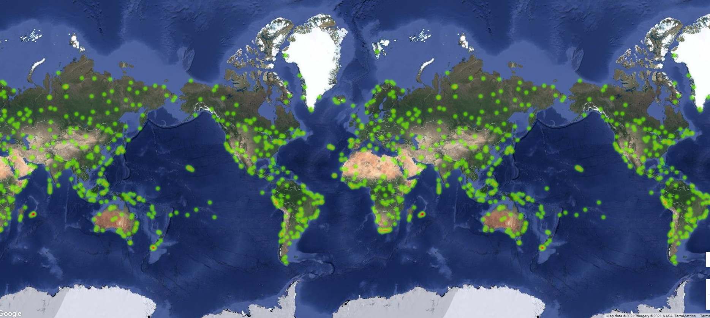
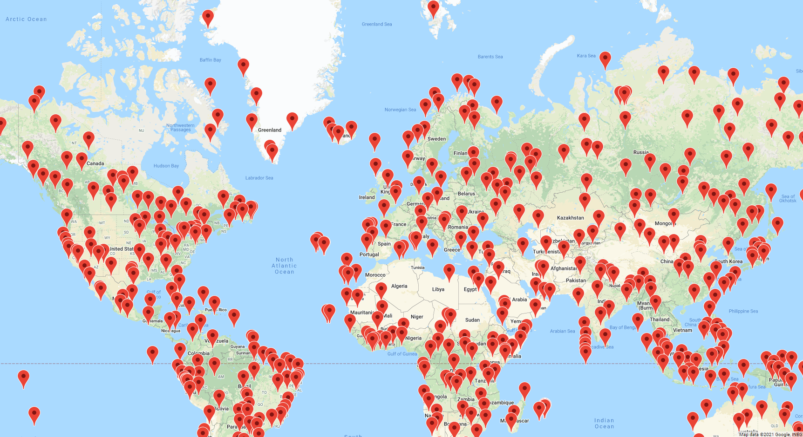
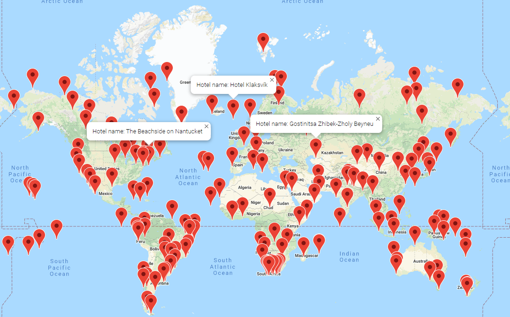
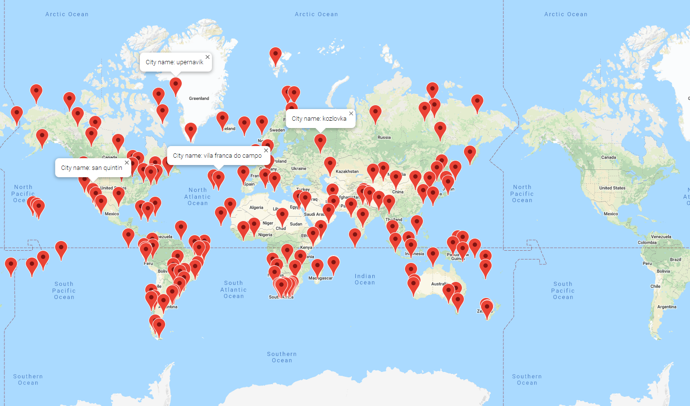
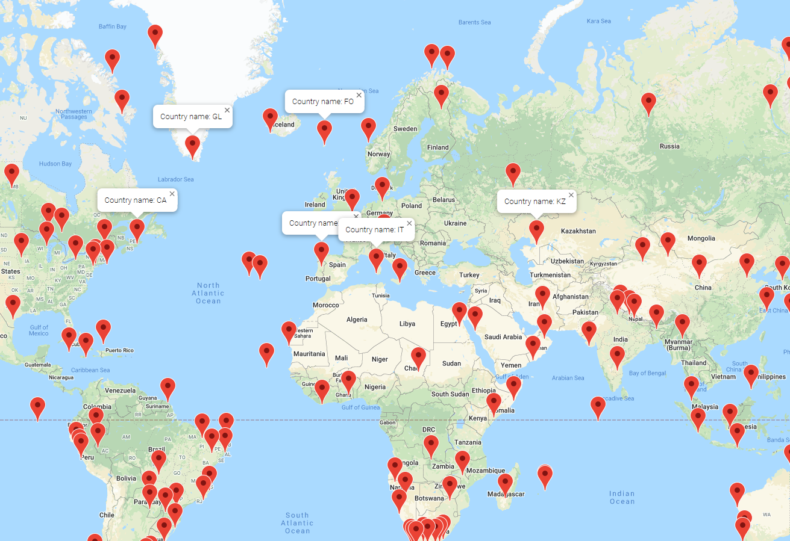
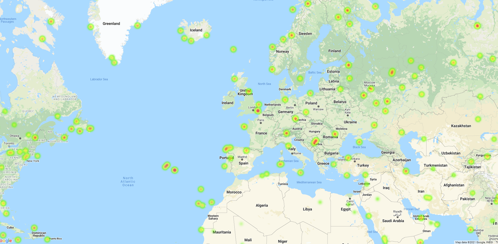

# Python_API_Challenge:
---
## Part I - WeatherPY:
---

Here we have created a series of scatter plots to analyse the following relationships:

- Temperature (F) vs. Latitude
- Humidity (%) vs. Latitude
- Cloudiness (%) vs. Latitude
- Wind Speed (mph) vs. Latitude

### Observable Trends: 
---

The first observable trend is in the scatter plot relationship between the 'Temperature' (F) vs. 'Latitude'.

- Here the "Temperature" increases for the "Latitude" values of below zero. 

- The "Temperature" rises to maximum value at a "Latitude" of data point 20 . 

- Then the "Temperature" starts decreasing as the "Latitude" starts increasing towards positve values.

The second observable trend is shown after performing the linear regression test on each relationship mentioned below:

* Northern Hemisphere - Temperature (F) vs. Latitude
* Southern Hemisphere - Temperature (F) vs. Latitude
* Northern Hemisphere - Humidity (%) vs. Latitude
* Southern Hemisphere - Humidity (%) vs. Latitude
* Northern Hemisphere - Cloudiness (%) vs. Latitude
* Southern Hemisphere - Cloudiness (%) vs. Latitude
* Northern Hemisphere - Wind Speed (mph) vs. Latitude
* Southern Hemisphere - Wind Speed (mph) vs. Latitude

 The relationship between 'Northern Hemisphere latitude' (greater than or equal to 0 degrees) and 'Temperature' is noticeable.  It is the statistical measure of strength between the two variables. The value range between -1.0 and +1.0. 

- The correlation coefficient factor between the 'Northern Hemisphere latitude' (greater than or equal to 0 degrees) and 'Temperature' of -0.85 shows a high negative relationship between the two factors.

- The 'r' square value ranges from 0 to 1. Higher number means better the model is. The r_square value of 0.66 between the 'Northern Hemisphere latitude' (greater than or equal to 0 degrees) and 'Temperature' shows that the model is able to fit almost 70% of variability in data points and the downward slop shows that there is a negative relationship between the two factors.

The third observable trend is shown in the relationship between the 'Southern Hemisphere latitude' (less than 0 degrees) and 'Temperature'.

- The correlation coefficient factor between the 'Southern Hemisphere latitude' (less than 0 degrees) and 'Temperature' of 0.78 shows a high positve relationship between the two factors.

- The r_square value between the 'Southern Hemisphere latitude' (less than 0 degrees) and 'Temperature'of 0.61 shows that the model is able to fit the 60% of variability of data points and positive relationship between the two factors.

## Part II - VacationPY:
---

Here the heatmaps describes the relationship between each city's location(latitude, longitude) and the 'Humidity'.

The screen shots of different heatmap are taken and image links are provided below:

